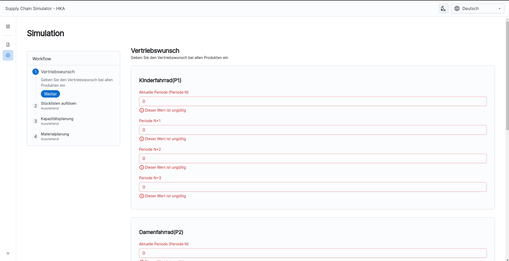

# Benutzerhandbuch des Supply-Chain-Simulators

Ramses II Tetang Zebowve \
SoSe 24 

Integrierte betriebliche Systeme 2 \
Hochschule Karlsruhe Technik und Wirtschaft

## Inhaltsverzeichnis

- [Installation und Voraussetzungen](#installation-und-Voraussetzungen)
- [Datenbank](#datenbank)
- [Backend Server](#backend-server)
- [Webanwendung](#webanwendung)
- [Grafische Benutzeroberfläche](#grafische-benutzeroberfläche)


## Installation und Voraussetzungen

Um das SCS-Projekt zu starten, benötigen Sie folgende Softwarekomponenten:

- **Docker**: Version 19.03.12 oder höher
```text
https://docs.docker.com/get-docker
```
- **Docker-Compose**: Version 1.26.2 oder höher
```text
https://docs.docker.com/get-docker
```
- **Java (OpenJDK)**: Version 17
```text
https://openjdk.org/projects/jdk/17
```
- **Gradle**: Version 8 oder höher
```text
https://gradle.org/install
```
- **NodeJS**: Version 20.15.0 oder höher
```text
https://nodejs.org/en/download/prebuilt-installer
```

Installieren Sie diese Software bzw. Werkzeuge gemäß den Anweisungen für Ihr Betriebssystem.


## Datenbank

Für das Supply Chain Simulator HKA (SCS-HKA) wird eine PostgreSQL-Datenbank verwendet. PostgreSQL ist ein 
relationales Datenbankmanagementsystem (RDBMS) mit einer starken Community und einer breiten Palette an Funktionen.

### Datenbank starten

Die Datenbank läuft als Docker-Container. Um die PostgreSQL-Datenbank zu starten, führen Sie den folgenden 
Befehl im Terminal aus:
```bash
docker compose up -d scs-db
```
**Wichtig !!!**: Beachten Sie aber, dass Sie sich im Wurzelverzeichnis des Backend-Projekts befinden.

Der obiger Befehl erstellt und startet den scs-db-Container im Hintergrund und zwar als Service. Das heißt, sollte 
der Host-Rechner neugestartet werden, wird die Datenbank automatisch mit hochfahren. Dies verhindert zu viele manuelle
Einstellungen.

#### Beachten Sie Folgendes

Stellen Sie sicher, dass Docker und Docker-Compose korrekt installiert und konfiguriert sind, bevor Sie den obigen 
Befehl ausführen. Die Konfiguration der Datenbank wird in der docker-compose.yml Datei des Projekts angegeben.


#### Persistierung von Daten

Um Daten aus dem Datenbank-Container auf dem Host-Rechner zu persistieren, verwenden Sie das Volume-Mapping in 
der docker-compose.yml Datei. Dafür passen Sie die Zeile 9 an und ersetzen Sie 
<code>/home/ramses/Documents/projects/volumes/database</code> durch einen gültigen Pfad auf Ihrem Rechner, wo Sie die
Daten aus dem Datenbank-Container persistieren möchten.

### Datenbank stoppen

Um die PostgreSQL-Datenbank zu stoppen, führen Sie den folgenden Befehl im Terminal aus:
```bash
docker compose stop scs-db
```

Dieser Befehl beendet den scs-db-Container und die Daten aus dem Container bleiben unter dem Pfad erhalten, den Sie
oben angegeben haben.


## Backend Server

Der Backend Server des Supply Chain Simulators HKA (SCS-HKA) wurde mit Spring Boot entwickelt und verwendet Gradle 
als Build-Tool. Um den Server zu starten, führen Sie die folgenden Schritte aus:

1. Stellen Sie sicher, dass Sie sich im Wurzelverzeichnis des Backend-Projekts befinden.
2. Öffnen Sie ein Terminal oder eine Eingabeaufforderung im Projektverzeichnis.
3. Führen Sie den folgenden Befehl aus, um das Projekt zu bauen:
```bash
./gradlew build
```

Dieser Befehl erstellt ein ausführbares JAR (Java-Archiv) im build/libs Ordner des Projekts.

4. Backend Server starten:
```bash
java -jar build/libs/scs-0.0.1-SNAPSHOT.jar
```

Dieser Befehl startet den Server auf dem Port 8082. Sie können den Port ändern, indem Sie die 
server.port-Eigenschaft in der application.properties oder application.yml Datei des Projekts konfigurieren.


## Webanwendung

Um die Webanwendung zu starten, führen Sie den folgenden Schritten aus:

1. Stellen Sie sicher, dass Sie sich im Wurzelverzeichnis des Frontend-Projekts befinden.
2. Öffnen Sie ein Terminal oder eine Eingabeaufforderung im Projektverzeichnis.
3. Installieren Sie die erforderlichen Abhängigkeiten, indem Sie den folgenden Befehl ausführen:
```bash
npm install
```

4. Starten Sie die Webanwendung:
```bash
npm run dev
```

Dieser Befehl startet den Webserver und öffnet die Webanwendung unter 
<a href="http://localhost:3000/scs-ui ">http://localhost:3000/scs-ui</a> im Browser.

## Grafische Benutzeroberfläche

Nach erfolgreichem Start der Webanwendung, öffnet sich die Startseite der Webanwendung:


Folgen Sie den Anweisungen auf der Startseite, um die Simulation zu starten:

- Importieren Sie Daten aus der Vorperiode:
     \
    Dann drücken Sie auf <code>Jetzt simulieren</code>, um fortzufahren.

- Geben Sie Ihren Vertriebswunsch für alle Produkte ein:
    
    Drücken Sie dann ganz unten auf <code>Vertriebswunsch speichern</code>
- Lösen Sie die Stücklisten auf
    
- Drücken Sie auf Weiter, um fortzufahren oder auf Zurück, um zum vorherigen Schritt zurückzukehren:
    